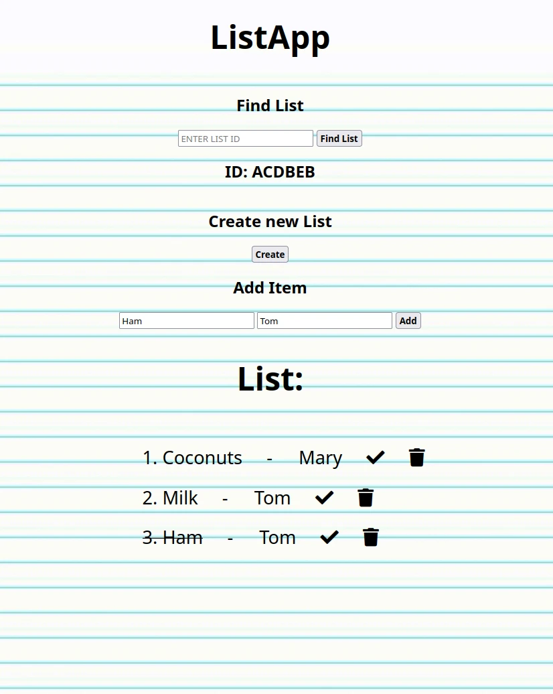

# ListApp v1.0
List application thought out to make shopping and daily activities more frictionless. Users can add, mark done and delete items in the list. Moreover, users can share their current List ID to other users in order to have a shared list. 

**Link to project:** https://e-list-app.herokuapp.com/

## How It's Made:

**Tech used:** HTML, CSS, JavaScript, Express as framework for Node.js and MongoDB.

## Optimizations
*(optional)*

Items with more than one word don't have 'mark done' functionality. It's a matter of how the request is sent from the front end to back end, as js reads the text in the current rendered template and sends it as a request to the server, targeted by element type. Perhaps making it identify it by class or id would work best, but time constraints have held me up on implementing it. 
Another aspect I would like to improve is the presentation (CSS), as currently it is very basic. Perhaps utilizing a framework like Tailwind could help speed up the process. 

Finally, I would like to add a pseudo-login screen where the user enters their name and don't have to write it on every item entry. An optional 'add Author' input could be added in case user is writting in place of a different user.

## Lessons Learned:

I made this project before I learned about MVC, so the server is in one single file and debugging can be very tedious. Searching for parts of the code is cumbersome. I would like to make a V2.0 where I implement MVC architecture.
I also learned about how objects nest data and store it in a database. It was challenging at first to troubleshoot not being able to read an array inside of an object, which itself has objects as elements (very confusing). In the future I would like to make a model that works better, as it is very fragile right now.

## Other versions:
Take a look at these couple examples that I have in my own portfolio:

**(fail): Attempt with React** https://github.com/Arikabz/2ListApp

**Business Website:** https://github.com/Arikabz/AguaV1

**A Book Api:** https://github.com/Arikabz/Book-Search-Api

